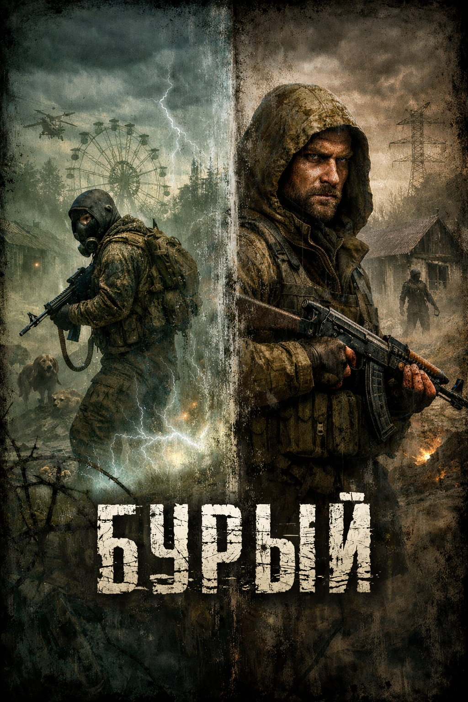

# БУРЫЙ
Сюжетный аддон для S.T.A.L.K.E.R. Anomaly

ОПИСАНИЕ

В Зоне всегда есть те, кто прячется от прошлого. Одним из таких стал человек по прозвищу Бурый. Никто не знает, чем он насолил на Большой земле и кому именно перешёл дорогу. Его история скрыта в тумане слухов и обрывках разговоров у костров. Одни говорят — бывший военный, другие шепчут — он хранит тайну. Но истина растворена в радиоактивной пыли, и Зона хранит её лучше любого сейфа.

За Бурым отправляют человека, которому поручено найти и устранить беглеца. Его имя стерто а в Зоне он получает новое прозвище — Пришлый. Никто не знает, откуда он явился, для сталкеров он чужак, для Зоны — очередной игрок в её смертельной игре.

Пришлый идёт по следу Бурого, но каждый шаг вглубь Зоны превращает охоту в испытание. Мутанты, аномалии, фанатики и наёмники — все словно проверяют его на прочность. И чем дальше он продвигается, тем сильнее ощущает: Зона не просто территория, она живая. Она наблюдает, испытывает и решает, кто достоин дойти до конца, а кто растворится в её безмолвии.

История мода — это не просто погоня. Это столкновение двух судеб: беглеца, скрывающегося от прошлого, и охотника, потерявшего своё будущее. Вопрос лишь в том, кто окажется сильнее — Бурый, знающий тропы Зоны, или Пришлый, у которого азарт охотника….

Общая информация

«Бурый» — сюжетный аддон для S.T.A.L.K.E.R. Anomaly, построенный вокруг одной простой, но жёсткой идеи:
чтобы найти человека, тебе придётся стать частью Зоны.
Игрок начинает игру не сталкером и не местным обитателем, а наёмником с Большой земли, отправленным в Зону по конкретному заказу. Цель — человек, который сбежал в Зону. Где он сейчас — не знает никто.

Завязка

Сразу после старта игры игрок получает сообщение и запись в КПК.
В них говорится, что цель ушла в Зону, контакт с ней потерян, а вся имеющаяся информация устарела.
Нет координат.
Нет маршрута.
Нет гарантий, что цель вообще жива.
Есть только задание — найти.

Основная идея мода

Суть мода можно описать коротко:
Чтобы найти человека, нужно углубиться в Зону.
Чтобы углубиться в Зону — нужно выжить в ней.
Зона не пускает чужаков глубоко сразу.
Чтобы продвигаться дальше, игроку придётся:
выполнять побочные задания;
зарабатывать репутацию;
обживаться на локациях;
добывать деньги, оружие и снаряжение;
налаживать контакты с торговцами и сталкерами.
Поиск цели невозможен без полноценной жизни в Зоне.

Поиск цели

Информация о беглеце разбросана по всей Зоне и никогда не даётся напрямую.
Кто-то что-то слышал.
Кто-то видел похожего человека.
Кто-то путает факты или врёт.
Чтобы получить новые зацепки, игрок вынужден:
ходить всё дальше от стартовых локаций;
выполнять задания для разных людей;
попадать в опасные районы;
рисковать ради очередного слуха или намёка.
Каждый шаг вглубь Зоны — это не прогресс по сюжету, а заслуженное право идти дальше.

Роль игрока

Постепенно герой перестаёт быть «человеком с Большой земли».
Он обзаводится схронами, снаряжением, знакомыми, долгами и обязательствами.
Он не планировал становиться сталкером —
но Зона не даёт выбора.
Чтобы закончить задание, ему придётся вжиться в Зону так же, как это сделал тот, кого он ищет.

Атмосфера

Мод делает упор на:
медленный, осмысленный геймплей;
чувство неопределённости;
отсутствие прямых указаний;
ощущение, что Зона проверяет игрока на прочность.
Поиск человека превращается в путь, на котором сам игрок рискует исчезнуть —
стать ещё одним безымянным следом в Зоне.

Итог

«Бурый» — это история не про героизм, а про втягивание.
Ты пришёл в Зону за человеком.
Но чтобы его найти, тебе придётся остаться в ней дольше, чем ты планировал.
И не факт, что выйти получится тем же, кем ты вошёл.
Если хочешь, дальше могу:
сделать очень короткое описание “в двух абзацах”;
адаптировать текст под ModDB / README;
или сразу перейти к реализации логики заданий и прогрессии.

Инструкция по установки
1. Скачиваем Anomaly 1.5.3 -> распаковываем
2. Скачиваем xray-monolith https://github.com/themrdemonized/xray-monolith -> распаковываем с заменой файлов (инструкция у автора движка есть)
3. Закидываем папку с аддоном в корень Anomaly
4. Запускаем игру через AnomalyLauncher

Благодарю за помощь в создании аддона человека под ником: 
PriestSL
